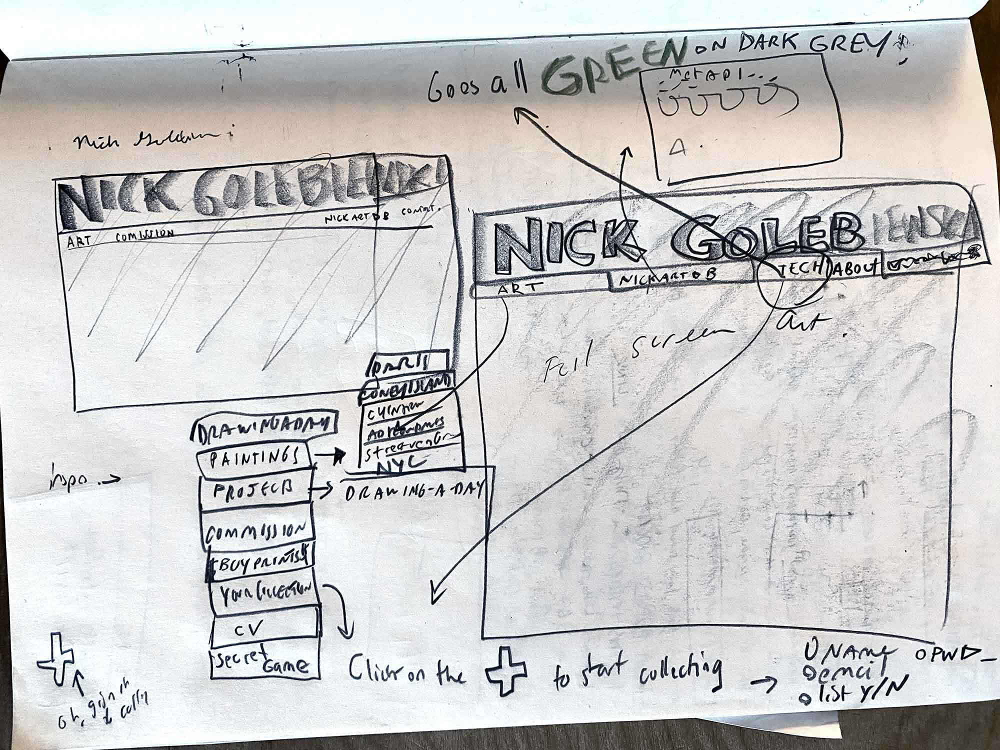

# Art and Coding Portfolio, by and for Nick Golebiewski

- Use Next.JS and Typescript, Prisma and PostgreSQL, and a bit of Python for data wrangling and writing to the database.
- Build SQL Database and scripts to import 4,000+ artworks from Instagram and Tumblr data dumps.
- Make art look good, and replace embarassing old Wordpress site, while showing off coding skills.
- Deploy on AWS + smartly set us DNS, while keeping some services (like SMTP mail server) on old school Dreamhost. 
- Increase art business, be able to find artworks, mobile friendly, etc.

## Development
- Deployed on Vercel with a Neon Database- 

## Dev Log

- Perhaps I should have used a more robust template, but here we go. A journey to learn Next and perhaps even get a working art portfolio in the mix. 
- Goal: Learn Typescript. Learn Next.js. GO!

1. Create project, git repo, and deploy on Vercel (hmmm it is so easy...)
2. Using pnpm as recommended.
3. Deployed on Vercel, auto with every push: https://next-art-portfolio-test.vercel.app/
4. Delete Vercel boilerplate -- although may have done with studying it a bit more first!
5. Create components folder, make a navbar. Note the use of Link rather than for partial reloads, so it acts like an app and avoids full page reloads
6. Create about/art/contact/tech directories and page.tsx files within.
    -   `mkdir -p src/app/{art,tech,about,contact} && touch src/app/{art,tech,about,contact}/page.tsx`
7. Make some sort of Gallery. Start with the 'Chinatown Series' and for the time being, rename images 1.jpg, 2.jpg, etc. as a placeholder
8. Discover Typescript with ESLint is like GoLang, and won't compile if there are unused imports and variables, and fix after I notice the last few commits didn't deploy.
9. Add in hero image for home page -> Will need to fix the verical scroll bar. Would be cool to put in a big p5.js animation interactive thing. 
10. Note: Oi Vey, will need to fix the sidebar on the left to disappear when on mobile.
11. Make the NavBar up top more mobile friendly, with a veggieburger and making the artist name font smaller. 
12. Hide sidebar for mobile/add to navbar dropdown on mobile
13. Digging the Rubik font: https://fonts.google.com/specimen/Rubik?categoryFilters=Feeling:%2FExpressive%2FBusiness;Sans+Serif:%2FSans%2F*
14. While I'm thinking of it, here's the initial sketched out design of the site...



14. Adding in my art cv. I already have it as a Google Doc. 
The amount I want to reformat it by hand is "not-at-all", so how about downloading the file as markdown and working with that?
OK, Next has something called MDX, but tryng a less complex version with react-markdown. Eventually I **should** refactor to the MDX, since it will probably be the nicest way to write content in the long run. I'm curious to see if the SSR will build properly and not give an error once off my local computer. Info: https://nextjs.org/docs/app/building-your-application/configuring/mdx
15. The linter is really strict. Run `pnpm next lint` BEFORE committing to GitHub and getting a failed deploy on Vercel!
16. make gallery slideshow with white background, rather than black, so it looks more art gallery-like. Not sure if I like the slight transparency or not.
17. Actually, gallery pop up back to black. white seemed like and error. If it was a card/detail situation white would make more sense. May end up moving to the latter solution, but that will be later on.
18. I like the markdown as content idea. It separates out the concern of writing content from the code. I think I will stick with that for stand alone text. Otherwise, content will be pulled from a data object. Therefore, made a markdown renderer component and a markdown fetcher util to add into pages that need content like this.
19. Went down a database rabbit hole!
    1.  Altough I had been making a quite robust, multiple artist and multiple user api and db with FastAPI and Python...
    2.  Integrating PRISMA as the ORM. 
    3.  DB choice: MySQL because I already pay for unlimited MySQL databases with the host I use. Otherwise would use Postgres. BUT! with Prisma the models in the schema are the same, so could build for any DB (I think)
    4.  Right now leaving out users and auth, because it's a one-person portfolio! Will do the bulk of uploading and data pre-processing when importing data from tumblr and instagram exports with Python. May even create a temporary SQLite DB for kicks! 
    5.  Working on the seed file.
    6. **PRISMA** commands:
       1. `npx prisma db push` because this instance of MySQL on a shared server does not allow for 'ghost databases' which I didn't know existed before the error Much better to use `Prisma migrate...` which would be the production way to do this.
       2. SEED: `pnpm prisma db seed`
          1. First test works! http://localhost:3000/api/technology
          2. Super cute emoji from Prisma here: `🌱  The seed command has been executed.`
          3. 
       3. `npx prisma studio`
          1. View your tables and data in a spun up server on your dev machine. Nice. 
 20. Added a Python Util folder. 
     1.  First script is just to output text files word ascii art for adding into comments here and there.
 21. Had lots of issues with deploying on Vercel with the Dreamhost MySQL. Turns out I had quotes around the database_url in the .env file! Also, Dreamhost requires a fixed IP address, something that doesn;t come out of the box with Vercel, so I switched to a Postgres database hosted on Neon. With Prisma it was easy! just changing a provider name and updating the database_url... Eventually in production, when I am on AWS, will have to revisit all of this deployment related stuff. In some ways I wish I just strated off there...
 22. More Prisma
     1.  With a proper Postgres, now using the migrate command for updates to the schema
     2.  `npx prisma migrate dev --name artwork_order`
     3.  `npx prisma generate`
 23. Note: WORK ON IMAGE OPTIMIZATION
 24. Structure for images. Portfolio images in public (~200 images). Drawing-a-day project images, perhaps habe at images.nickgolebiewski.com on Dreamhost -- it would be insane to push up 4,000+ images on every deploy! Will need to work out an upload procedure.
 25. Working more on the seed file.
 26. Import data from Tumblr and Instagram 'download your data' requests to populate the drawing a day project.
     1.  Python for this. See: 
 27. Trying to get a first pass at visualizing all that tech projects data -- and bringing in https://ui.shadcn.com/docs/installation ShadCN components.
 28. I LOVE ❤️ this font! https://departuremono.com/  --> Added to the tech portfoio page.
 29. Grab the footer with social media links and logos from my old tech portfolio site, salvaging useful components. Make it more DRY (do not repeat yourself)
 30. Added figlet with js and dool example -> https://patorjk.com/software/taag/#p=display&f=Isometric1&t=Tech%0Aprojects
 31. Went down on a tangent, once incorporating server side render for markdown content the way I set it up and choosing a semi-random figlet font on the about page. Way too much time!
 32. Time to save on compute for the online db, and set up a local development instance of Postgres.
     1.  Create a new Postgres DB locally (assuming you already have psql installed via homebrew, etc.)
     2.  Start Postgres: `psql postgres`
     3.  Create database: `CREATE DATABASE art_db_next`
     4.  Connect to new db: `\c art_db_next`
     5.  Update .env `DATABASE_URL="postgresql://<username>:<password>@localhost:5432/art_db_next"`


## ------Next.js Template boilerplate below------------------


This is a [Next.js](https://nextjs.org) project bootstrapped with [`create-next-app`](https://nextjs.org/docs/app/api-reference/cli/create-next-app).

## Getting Started

First, run the development server:

```bash
npm run dev
# or
yarn dev
# or
pnpm dev
# or
bun dev
```

Open [http://localhost:3000](http://localhost:3000) with your browser to see the result.

You can start editing the page by modifying `app/page.tsx`. The page auto-updates as you edit the file.

This project uses [`next/font`](https://nextjs.org/docs/app/building-your-application/optimizing/fonts) to automatically optimize and load [Geist](https://vercel.com/font), a new font family for Vercel.

## Learn More

To learn more about Next.js, take a look at the following resources:

- [Next.js Documentation](https://nextjs.org/docs) - learn about Next.js features and API.
- [Learn Next.js](https://nextjs.org/learn) - an interactive Next.js tutorial.

You can check out [the Next.js GitHub repository](https://github.com/vercel/next.js) - your feedback and contributions are welcome!

## Deploy on Vercel

The easiest way to deploy your Next.js app is to use the [Vercel Platform](https://vercel.com/new?utm_medium=default-template&filter=next.js&utm_source=create-next-app&utm_campaign=create-next-app-readme) from the creators of Next.js.

Check out our [Next.js deployment documentation](https://nextjs.org/docs/app/building-your-application/deploying) for more details.
